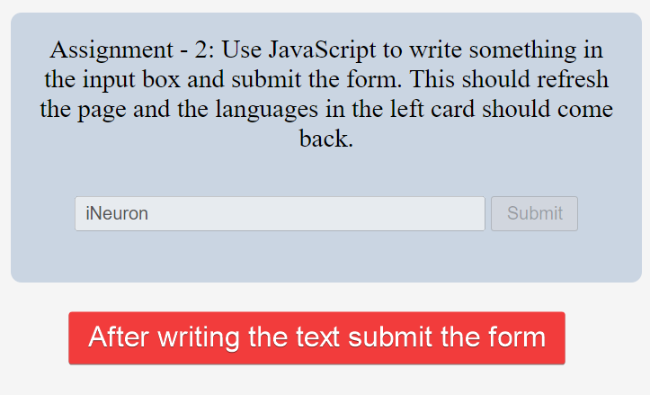

# **_DOM Assignments 7_** :-

**_Task 1_** : Remove all the languages conataining 2.0 string.

### Before image 👇


### After image 👇


Ans. Code :

```
<!-- Target all anchor elements -->
const courseRemoved = document.querySelectorAll("a");

<!-- copied content with spread -->
const newArr = [...courseRemoved];

<!-- 2.0 items are removed -->
newArr.forEach((item) => {
  if (item.textContent.includes("2.0")) {
    item.style.display = "none";
    return item;
  }
});

```

---

---

**_Task 2_** : Use JavaScript to write something in
the input box and submit the form. This should refresh
the page and the languages in the left card should come
back.

### Before image 👇


### After image 👇



Ans. Code :

```
<!-- input element is selected -->
const inputEl = document.querySelector(".main__form-input");

<!-- disabled attribute removed -->
inputEl.removeAttribute("disabled");

const submitBtn = document.querySelector(".main__form-btn");
submitBtn.removeAttribute("disabled");


<!-- event executed on form submission -->
const formEl = document.querySelector("form");
formEl.addEventListener("Submit", (e) => {
  arr2.forEach((item) => {
    if (item.textContent.includes("2.0")) {
      item.style.display = "inline";
      return item;
    }
  });
});

```

---

---

# **🧡 Thank you for visiting 💚 !**
