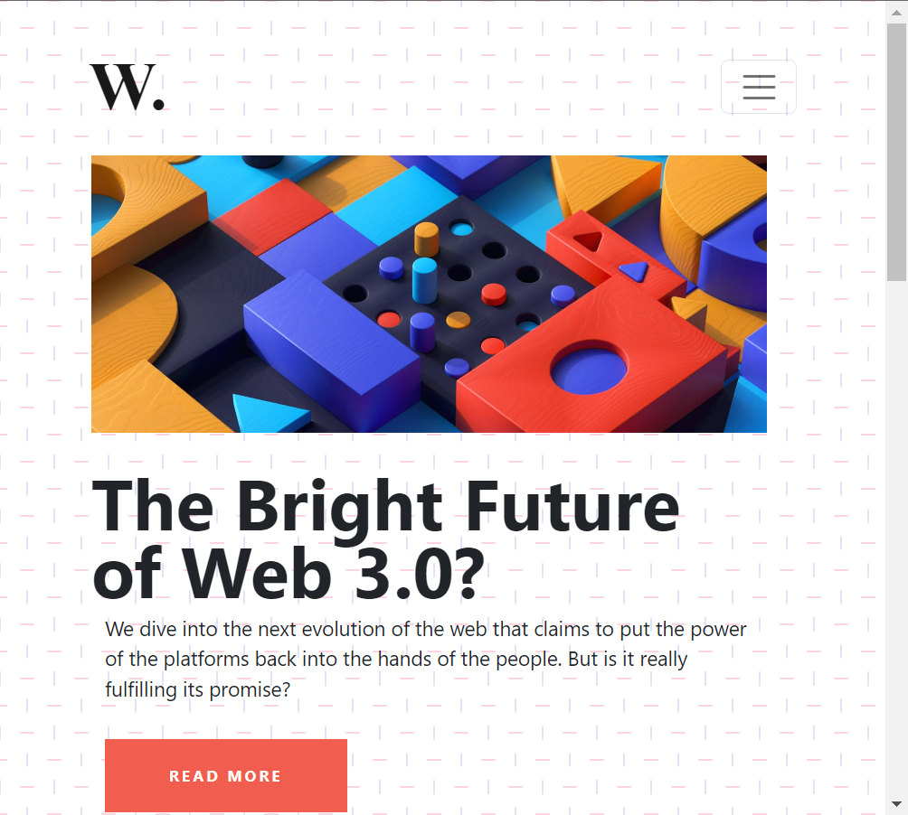

# **_DOM Assignments 8_** :-

**_Task 1_** : Add a custom heading in aside section and with border red give scroll along y-axis.

### Before image 👇


### After image 👇


Ans. Code :

```
<!-- Target aside element-->
const asideEl = document.querySelector("aside");

<!--create child elements  -->
const newH2 = document.createElement("h2");
const hrLine = document.createElement("hr");
const para = document.createElement("p");

<!-- add content in child elements and add classes -->
newH2.className = "new-head";
hrLine.className = "hr-line";
para.className = "new-p";
newH2.innerHTML = "This is my custom heading";
para.innerHTML = "This is my custom para ";


<!-- add styles to aside and new elements and append -->
asideEl.appendChild(hrLine);
asideEl.appendChild(newH2);
asideEl.appendChild(para);

asideEl.style.overflowY = "scroll";
asideEl.style.overflowX = "hidden";

```

---

---

**_Task 2_** : Make the background of page clear (White).

### Before image 👇


### After image 👇


Ans. Code :

```
document.body.style.backgroundImage = "none";
```

---

---

**_Task 3_** : Make the background of page clear (White).

### Before image 👇



### After image 👇


Ans. Code :

```

<!-- target the elements  -->
const navbarEl = document.querySelector(".navbar");
const logo = document.querySelector(".navbar-brand");
const buttonEl = document.querySelector(".navbar-toggler");
const navListEl = document.querySelector("#navbarTogglerDemo01");

<!-- creating div and appending elements -->
const divEl = document.createElement("div");
divEl.appendChild(buttonEl);
divEl.appendChild(navListEl);

navbarEl.appendChild(divEl);

<!-- adding events on button -->

buttonEl.addEventListener("click", () => {
  logo.style.position = "relative";
  logo.style.bottom = "85px";

  buttonEl.style.width = "max-content";
  buttonEl.style.marginLeft = "50px";
  buttonEl.style.marginBottom = "20px";

  navListEl.removeAttribute("class", "collapse");

  buttonEl.addEventListener("click", () => {
    navListEl.setAttribute("class", "collapse");
    logo.style.position = "static";
  });
});

```

# **🧡 Thank you for visiting 💚 !**
