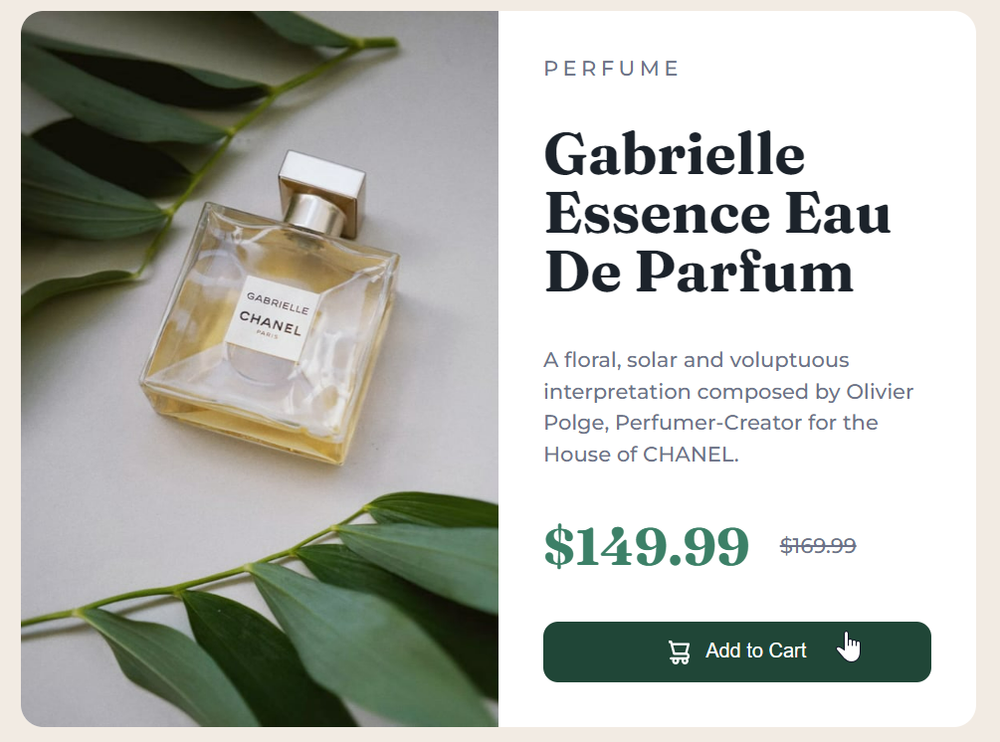

# ***DOM Assignments 9*** :-

***Task 1*** : Change the heading color.

### Before image


### After image


Ans. Code :

```
const title = document.querySelector("h1");
title.style.color = "#D61355";
```
___
___

***Task 2*** : Change the color color of cart button on click event.

### Before image 👇


### After image 👇


Ans. Code :

```
const btnEl = document.querySelector('button');

btnEl.addEventListener('click', () => {
    btnEl.style.backgroundColor = '#D61355'
})

```
___
___
#  💚 If you like hit that star 💫 for this repository 😉.
# 💥💛 Thanks for visiting ❤️!